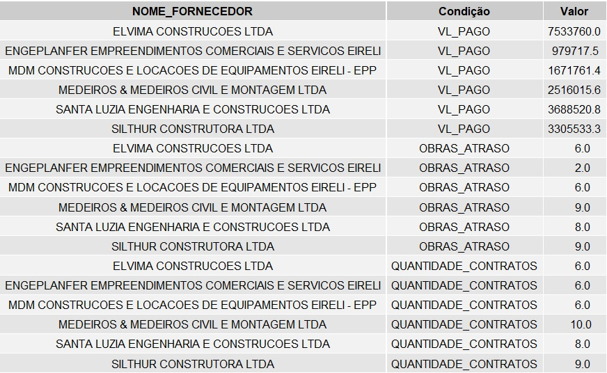

# Desafio---Estágio-em-Análise-de-Dados---Inova_MPRJ-2020
### João Passeri
---

## O Desafio

Utilizando dados públicos estruturados disponibilizados pela Plataforma +BRASIL, encontrar indicadores que joguem luz sobre as questões **"Quais obras públicas atrasam? Quais os fatores associados a esse atraso?"**.

## O Caminho

A Plataforma +BRASIL conta com todos os dados do SICONV (Sistema de Gestão de Convênios e Contratos de Repasse) que por sua vez contabiliza informações desde 2008. Para compreensão das informações dispostas na plataforma e se inteirar sobre o problema em questão, foram usados alguns arquivos para leitura.
São Eles:

* [12 SICONV E A SITUAÇÃO CONVÊNIOS MUNICIPAIS NO BRASIL](https://www.cnm.org.br/cms/biblioteca/ET_Vol_9_12.Siconv_e_a_situacao_convenios_municipais_no_Brasil.pdf)
* [Relação dos códigos de natureza de despesa com a descrição SICONV- Convênios](http://www.convenios.rj.gov.br/convenios_imagens/biblioteca/17_01_2018___12_26_28___Tabela_de_Nat_de_despesa_Siconv.pdf)
* [Convênio, Contrato de Repasse e Termo de Parceria Operados por OBTV (Ordem Bancária de Transferências Voluntárias) Passo a Passo - Convenente](http://plataformamaisbrasil.gov.br/images/OBTV_Convenio_Contrato_de_Repasse_e_Termo_de_Parceria_Operados_por_OBTV.pdf)

Após análise e leitura dos documentos, e com os dados em questão o **caminho** para identificar possíveis indicadores de atrasado poderiam estar relacionados aos envolvidos no processo e valores da investidos.
São Eles:

* **Proponentes:** Agente que propõe, solicita.
* **Concedente:** Órgão Concedente.
* **Fornecedores:** Empresas envolvidas nas obras.
* **Valor Global:** Valor total investido.
* **Valor Contrapartida:** Valor de colaboração financeira do convenente (foi analisado em percentual).
* **Valor Emenda:** Valor vindo de emenda parlamentar (foi analisado em percentual).

## Explorando

Para realizar a análise dos indicadores foram criadas duas tabelas que estão disponíveis neste repositório.

- data_base
- data_fornecedor

Essas planilhas contam com informações sobre todos os envolvidos no processo, e são um recorte da base de dados, todas as propostas são do estado do Rio de Janeiro, tiveram seus contratos originalmente vencidos a partir de 2015 e são despesas da classe Obra, além disso, são considerados contratos vencidos convênios com fim original para 23/07/2020. Foi fixado a escolha de somente dois indicadores.

Neste gráfico podemos analisar o percentual de obras que atrasaram.

  

A tabela *data_forcedor* indica a quantidade total recebido pelos fornecedores, total de obras que participou e total de participações em obras com atraso.

Nesta planilha podemos analisar um recorte dos fornecedores com maior participação.

  

Percebe-se que muitos fornecedores tiveram todas as suas participações em obras com atraso, portando um dos indicadores é **FORNECEDOR**.

Para analisar os outros possíveis indicadores de atraso, foi construído um método que por encadeamento de decisões tenta ponderam o quão importante é uma variável na decisão se uma obra irá atrasar ou não.

Neste gráfico podemos analisar o grau de importância, para melhorar o entendimento das variáveis consultor planilha *dicionario de variaveis*.

  

Conforme podemos perceber o **Valor Global** do convênio teve importância de quase 90 pontos, logo este foi escolhido como indicador. 

